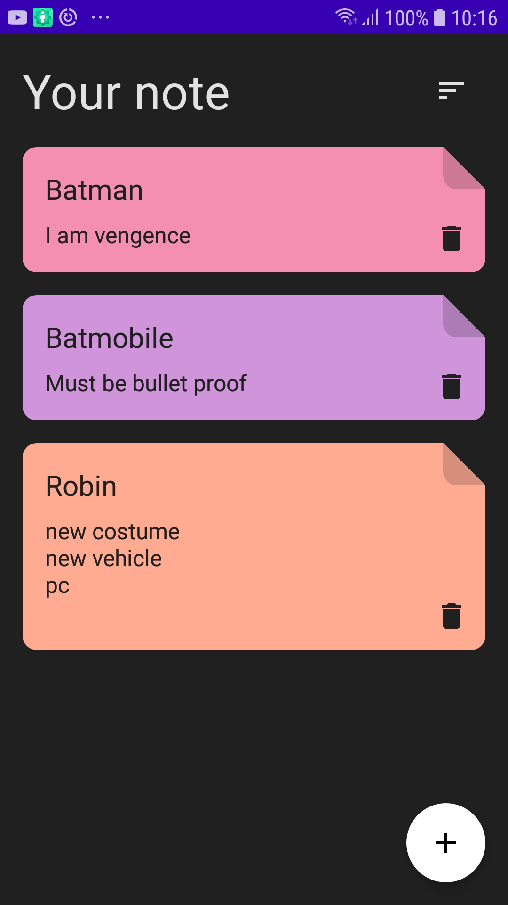
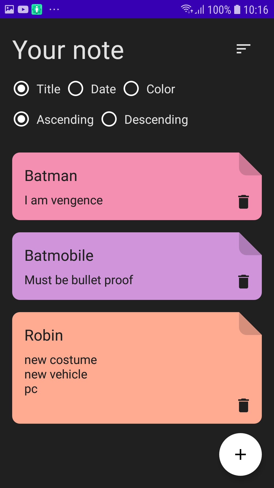

# Iris-Notes
App for registering notes

## The Brief

App that allows user to create, edit and delete notes

## Architecture & Libraries
    - MVVM
    - ROOM Database
    - Dependency Injection - Dagger-Hilt
    - Kotlin Coroutines
    - Navigation Component
    - Flow
    - Clean architecture

## App preview:

Image #1            |  Image #2             |  Image #3           
:-------------------------:|:----------------------------:|:----------------------------:
    |       |   
